# Cybersecurity: DVWA LAMP Stack Deployment Guide

## Table of Contents
- [Project Overview](#-project-overview)
- [System Architecture & Prerequisites](#️-system-architecture--prerequisites)
- [Deployment Methodology](#-deployment-methodology)
  - [Phase 1: Environment Update & Core Installation](#phase-1-environment-update--core-installation)
  - [Phase 2: Service Initialization](#phase-2-service-initialization)
  - [Phase 3: Repository Cloning & Access Controls](#phase-3-repository-cloning--access-controls)
  - [Phase 4: Database Provisioning](#phase-4-database-provisioning)
  - [Phase 5: Application Configuration](#phase-5-application-configuration)
  - [Phase 6: PHP Hardening (RFI Enablement)](#phase-6-php-hardening-rfi-enablement)
  - [Phase 7: Final Initialization & Deployment](#phase-7-final-initialization--deployment)
- [Conclusion](#-conclusion)

---

## Project Overview
This repository documents the complete infrastructure deployment of the Damn Vulnerable Web Application (DVWA). Rather than relying on pre-built containers, this lab demonstrates the manual configuration of a full **LAMP Stack** (Linux, Apache, MariaDB, PHP) on Kali Linux. It covers package installation, service management, SQL database creation, secure file permissions, and advanced PHP configuration to prepare the environment for penetration testing.

## System Architecture & Prerequisites
*   **Operating System:** Kali Linux
*   **Web Server:** Apache2
*   **Database Engine:** MariaDB Server
*   **Backend Language:** PHP (with `mysqli`, `gd`, and `mod-php` extensions)
*   **Target Application:** DVWA (Damn Vulnerable Web Application)

---

## Deployment Methodology

### Phase 1: Environment Update & Core Installation

To ensure the system retrieves the latest security patches and stable dependencies, the local APT package index was updated. The `-y` flag automatically affirms the prompt.
 

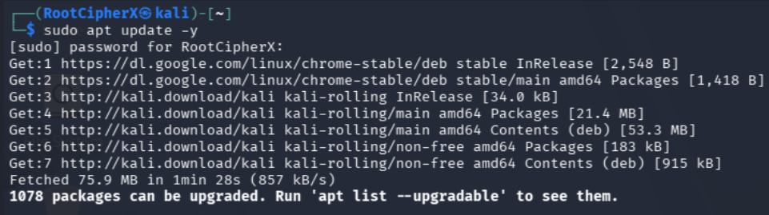

Next, the core LAMP stack components and PHP extensions required by DVWA were installed in a single command. 
*   **Command Breakdown:** `sudo apt install apache2 mariadb-server php php-mysqli php-gd libapache2-mod-php -y`
*   `apache2`: The web server daemon.
*   `mariadb-server`: The SQL database backend.
*   `php` & `libapache2-mod-php`: The core PHP processing engine for Apache.
*   `php-mysqli` & `php-gd`: Essential PHP extensions for database connectivity and image processing.
 

---

### Phase 2: Service Initialization

The MariaDB database service must be initialized before it can accept SQL queries. The `start` command boots the daemon.
 

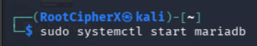

To ensure the database survives system reboots, the `enable` command creates a persistent symbolic link for the service to start on boot.
 

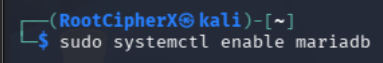

The `status` command was utilized to verify that the MariaDB service was actively running and successfully bound to the local loopback interface without errors.
 

---

### Phase 3: Repository Cloning & Access Controls

The official DVWA source code was pulled directly from GitHub into the Apache web root directory.
*   **Command Breakdown:** `sudo git clone https://github.com/digininja/DVWA.git /var/www/html/dvwa`
 

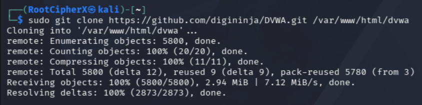

By default, files cloned via `sudo` belong to the `root` user. Apache requires ownership to safely serve these files. 
*   **Command Breakdown:** `sudo chown -R www-data:www-data /var/www/html/dvwa` changes the recursive (`-R`) ownership of the folder to the `www-data` service account.
 

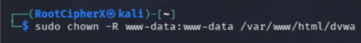

Standard web directory permissions were applied to ensure secure access.
*   **Command Breakdown:** `sudo chmod -R 755 /var/www/html/dvwa` grants read, write, and execute permissions to the owner (`7`), and read/execute permissions to the group and others (`55`).
 

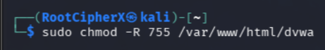

---

### Phase 4: Database Provisioning

Accessed the MariaDB SQL command-line interface using the local root account.
 

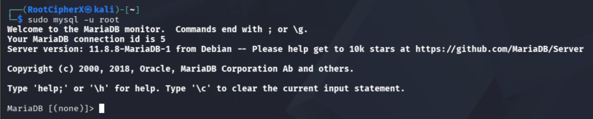

A dedicated backend database and user were provisioned exclusively for DVWA to adhere to the Principle of Least Privilege.
*   **Command Breakdown:**
    *   `CREATE DATABASE dvwa;`: Builds the database structure.
    *   `CREATE USER 'dvwauser'@'localhost' IDENTIFIED BY 'password';`: Creates a local application user.
    *   `GRANT ALL PRIVILEGES ON dvwa.* TO 'dvwauser'@'localhost';`: Binds full permissions for the user strictly to the `dvwa` database.
    *   `FLUSH PRIVILEGES;`: Reloads the grant tables to apply the new rules immediately.
 

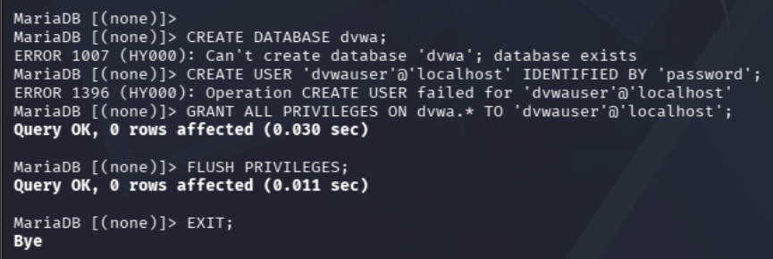

---

### Phase 5: Application Configuration

DVWA ships with a template configuration file that must be modified. The `nano` text editor was used to open the template file.
 

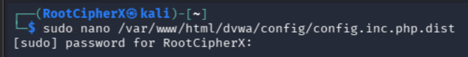

The `nano` interface displaying the default database variables.
 

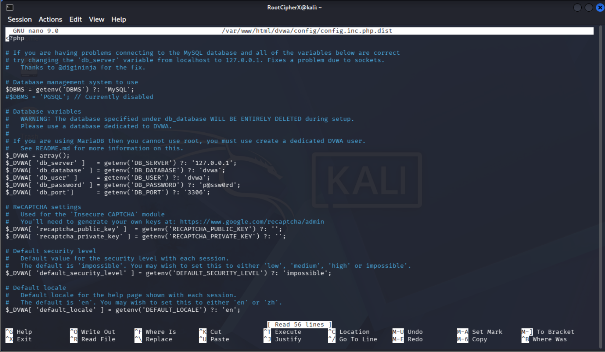

The `$_DVWA` array variables were updated to match the SQL credentials created in Phase 4 (`dvwauser` and `password`).
 

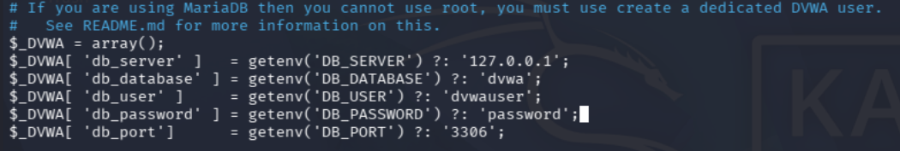

To activate the configuration, the file was written to disk and the `.dist` extension was explicitly removed.
 

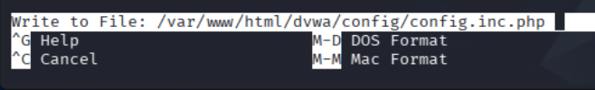

Confirmed the file name change within the nano editor prompt to ensure the application recognizes `config.inc.php`.
 

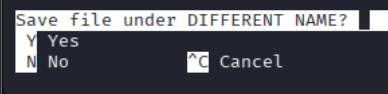

---

### Phase 6: PHP Hardening (RFI Enablement)

By default, Kali Linux hardens PHP by disabling remote file inclusion. To allow DVWA's RFI modules to function correctly during penetration testing, the core `php.ini` file required modification.
*   **Command Breakdown:** `sudo nano /etc/php/*/apache2/php.ini` targets the global Apache PHP configuration file.
 

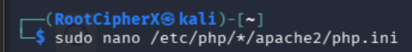

Inside the `nano` editor, the search function was initiated using the `Ctrl+w` shortcut to rapidly locate the `allow_url_include` directive among thousands of lines of configuration.
 

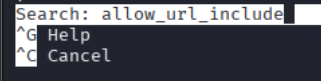

The parameter was explicitly modified from `Off` to `On`, instructing the PHP engine to allow the treatment of remote URLs as local files.
 

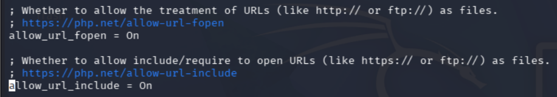

The changes to `php.ini` were successfully written and saved to disk.
 

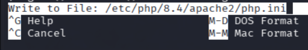

---

### Phase 7: Final Initialization & Deployment

The `mysqli` PHP extension was explicitly enabled at the system level to ensure proper communication between PHP and the MariaDB backend.
 

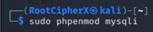

To apply all application and PHP configuration modifications, the Apache web server daemon was restarted.
*   **Command Breakdown:** `sudo systemctl restart apache2`
 

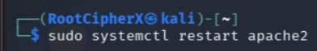

Navigated to `http://localhost/dvwa/setup.php` via a web browser. The DVWA environment checks successfully validated the presence of the required backend modules and writable directories.
 

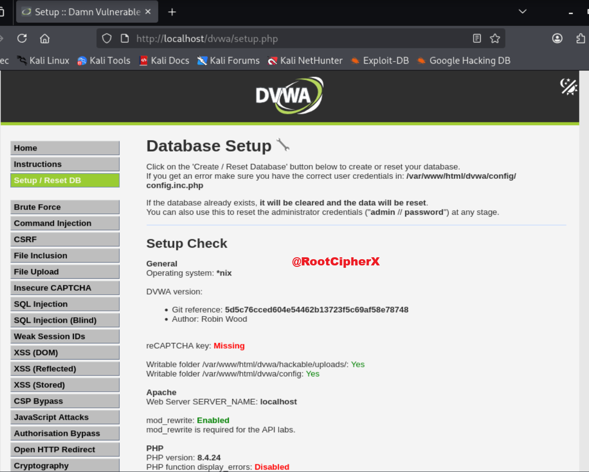

Scrolled to the bottom of the setup page and initialized the database creation script by clicking the "Create / Reset Database" button.
 

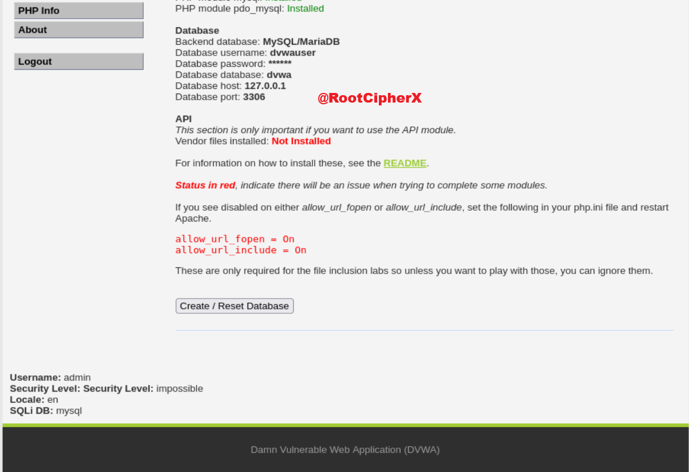

The backend PHP scripts successfully connected to MariaDB, constructed the necessary tables (`users`, `guestbook`, `access_log`), and injected the default application data.
 

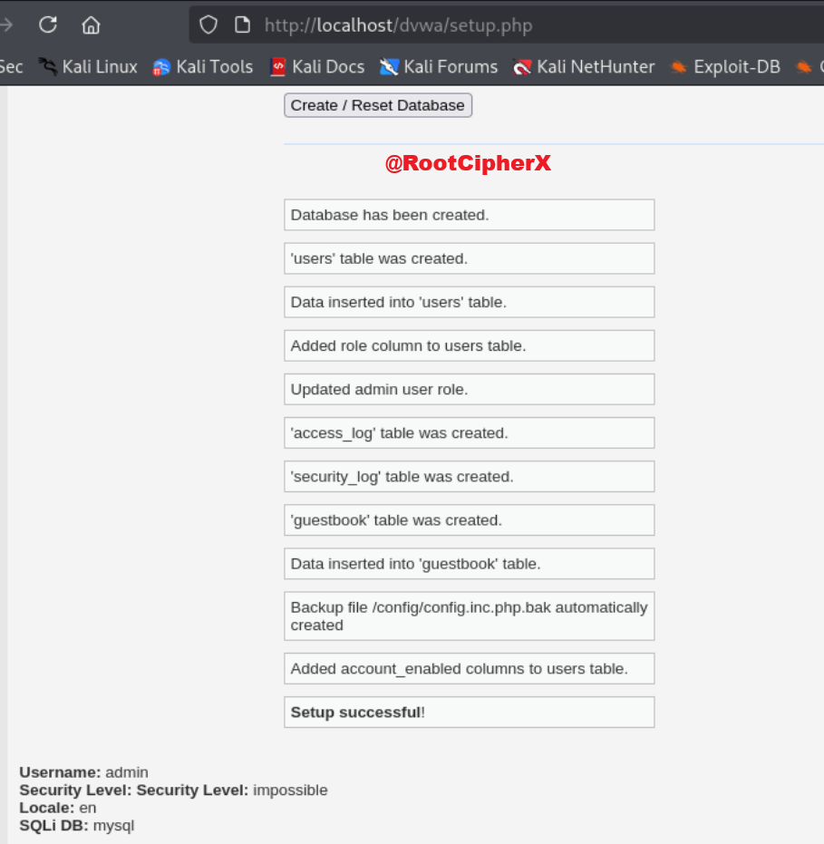

The deployment was finalized by successfully authenticating to the DVWA portal using the default administrative credentials (`admin` / `password`).
 

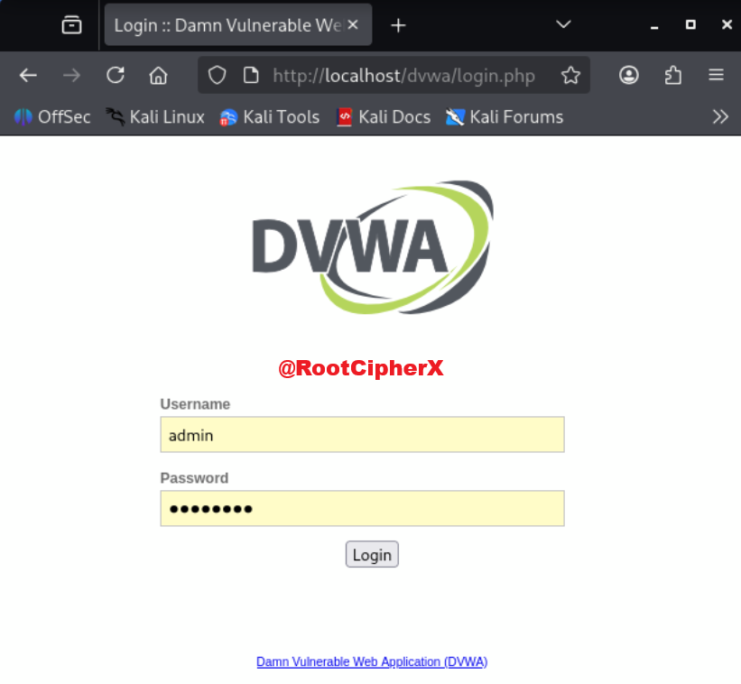

---

## Conclusion
This project successfully demonstrates the manual, ground-up deployment of a vulnerable web application infrastructure. By configuring Apache, MariaDB, and PHP directly from the command line, absolute control over the environment variables and security constraints was achieved, creating a perfect laboratory for advanced web exploitation testing.
